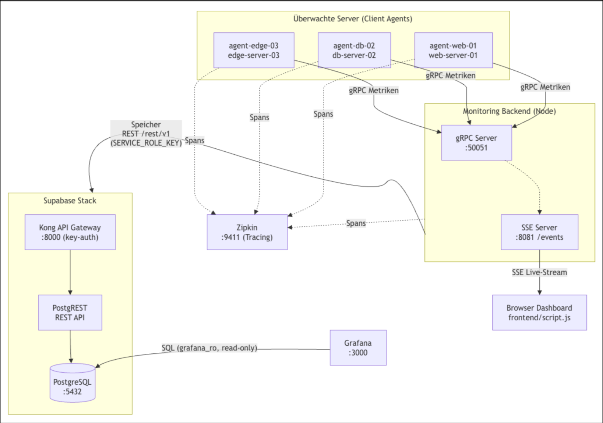
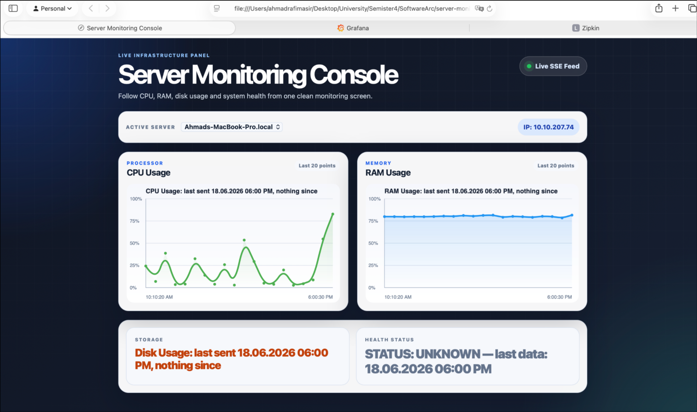
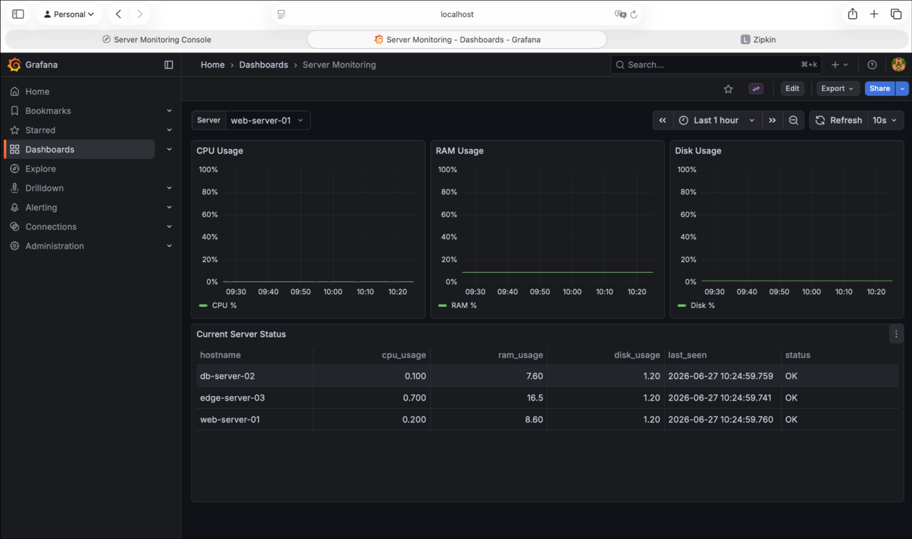
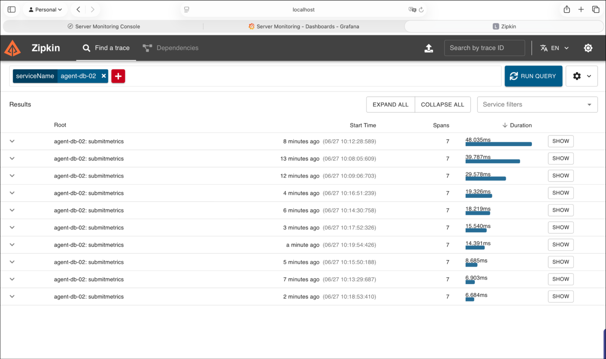
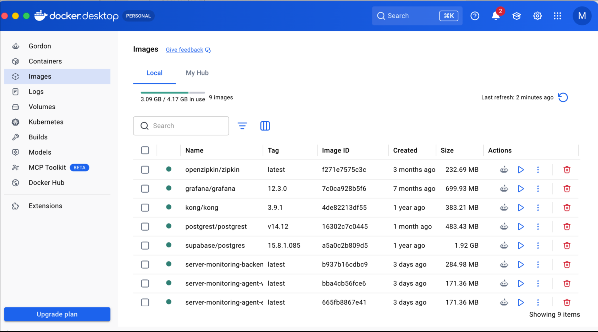

# Server Monitoring System – Erweiterung

## Titel des Themas

**Vom lokalen Prototyp zum containerisierten, observierbaren Monitoring-Verbund** –
Ablösung der lokalen SQLite-Datenhaltung durch einen PostgreSQL-/Supabase-Stack,
Containerisierung von Backend und Agents sowie Ergänzung von Grafana (historische
Dashboards) und Zipkin (verteiltes Tracing).

---

## Gruppenmitglieder
- Ahmad Rafi Masir
- Rifat Derman
- Mojtaba Hassan Erfani
- Andreas Baldauf
- Helma Arjmand
- Alena Vodopianova

## Ziel der Erweiterung

Das bestehende Monitoring-System bestand bislang aus einem Backend mit lokaler
SQLite-Datenbank und einer Handvoll Client-Agents, die alles direkt und lokal
ausführten. Ziel der Erweiterung ist es, dieses System von einem lokalen Prototyp zu
einem **betriebsreifen, containerisierten Verbund** auszubauen: Die Datenhaltung wird
von SQLite auf eine **PostgreSQL-Datenbank (Supabase-Stack mit Kong-Gateway und
PostgREST)** umgestellt, um Persistenz, Mehrbenutzerzugriff und eine saubere
API-Schicht zu erhalten. Backend und Agents werden **vollständig containerisiert
(Docker)**, sodass der gesamte Stack reproduzierbar und mit einem Befehl startbar ist.
Für die historische Auswertung der Metriken wird **Grafana** ergänzt (read-only-Zugriff
auf die Datenbank), und für **Observability** wird verteiltes Tracing mit
**OpenTelemetry/Zipkin** eingeführt, um den Weg einer Metrik von den Agents über das
Backend bis in die Datenbank nachvollziehbar zu machen.

---

## Komponentendiagramm

---

**Datenflüsse in Kürze:**

| Pfad | Beschreibung |
|---|---|
| **Schreiben** | Agent → gRPC → Kong → PostgREST → PostgreSQL |
| **Live-Updates** | gRPC `broadcastToFrontends()` (prozessintern) → SSE → Browser |
| **Erstbefüllung** | SSE `getInitialMetrics()` → Kong → PostgREST → PostgreSQL |
| **Historie** | Grafana → PostgreSQL (direkt, read-only `grafana_ro`) |
| **Tracing** | Agents & Backend → Zipkin (OpenTelemetry-Spans) |

> Hinweis: gRPC-Handler und SSE-Server laufen im **selben Backend-Prozess**;
> der Live-Push ist ein interner Funktionsaufruf, kein Netzwerk-Request.

<!-- Optional: gerendertes Diagramm als Bild -->
<!--  -->

---

## Ergebnisse als Screenshots

<!-- Screenshots hier einfügen. Pfade ggf. anpassen. -->

### Browser-Dashboard (Live-Metriken via SSE)

### Grafana (historische Metriken)

### Zipkin (verteiltes Tracing)

### Docker-Container (`docker compose ps`)

---

## Ergebnis

Das Monitoring-System wurde erfolgreich von einem lokalen Prototyp zu einem vollständig
**containerisierten Verbund** ausgebaut, der mit einem einzigen `docker compose`-Befehl
startbar ist. Die Datenhaltung läuft jetzt über eine **PostgreSQL-Datenbank im
Supabase-Stack**, auf die das Backend ausschließlich über das **Kong-API-Gateway und
PostgREST** zugreift (mit Key-/JWT-Authentifizierung) – SQLite und der direkte
DB-Zugriff der Anwendung wurden abgelöst. **Backend und alle drei Client-Agents**
(`web`, `db`, `edge`) laufen in eigenen Containern mit individuellen Ressourcen-Limits.
Für die historische Auswertung steht **Grafana** bereit, das die Metriken über eine
dedizierte **read-only-Rolle (`grafana_ro`)** direkt aus der Datenbank visualisiert.
Zusätzlich liefert **verteiltes Tracing mit OpenTelemetry/Zipkin** durchgängige
Nachvollziehbarkeit: Der Weg einer Metrik vom Agent über den gRPC-Handler des Backends
bis in die Datenbank ist als Trace einsehbar. Das Live-Dashboard im Browser erhält
seine Daten weiterhin in Echtzeit per **Server-Sent Events**, während die Erstbefüllung
aus der Datenbank kommt.
